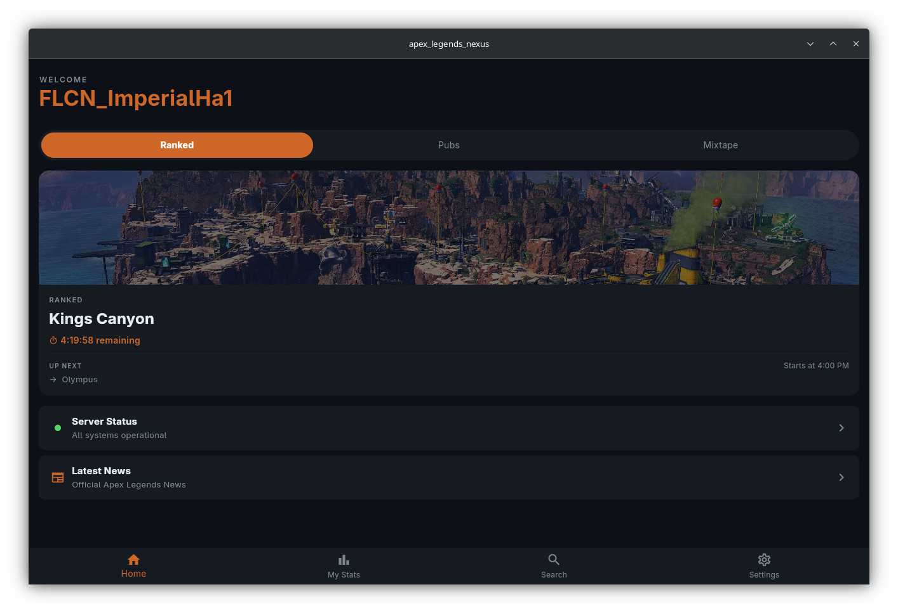
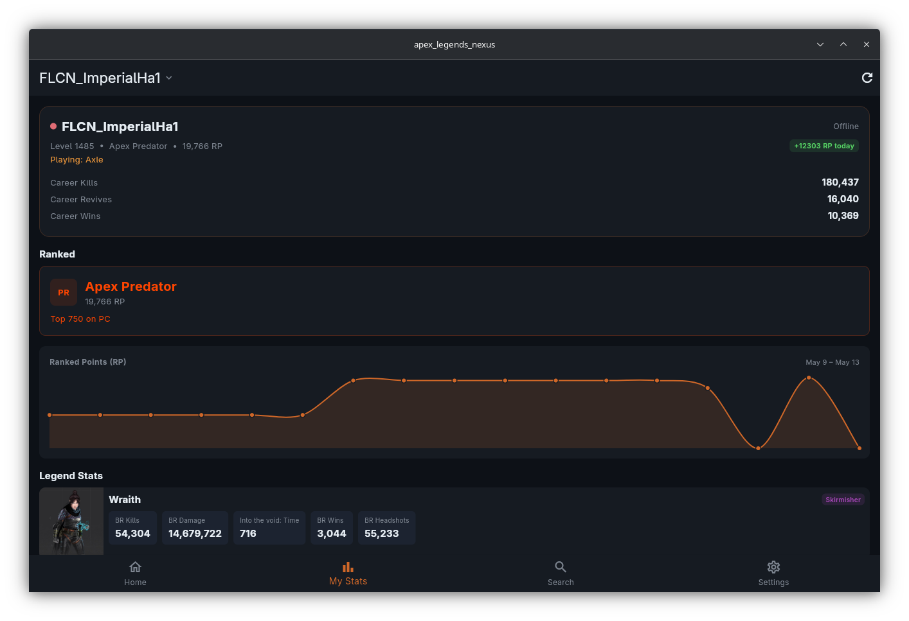
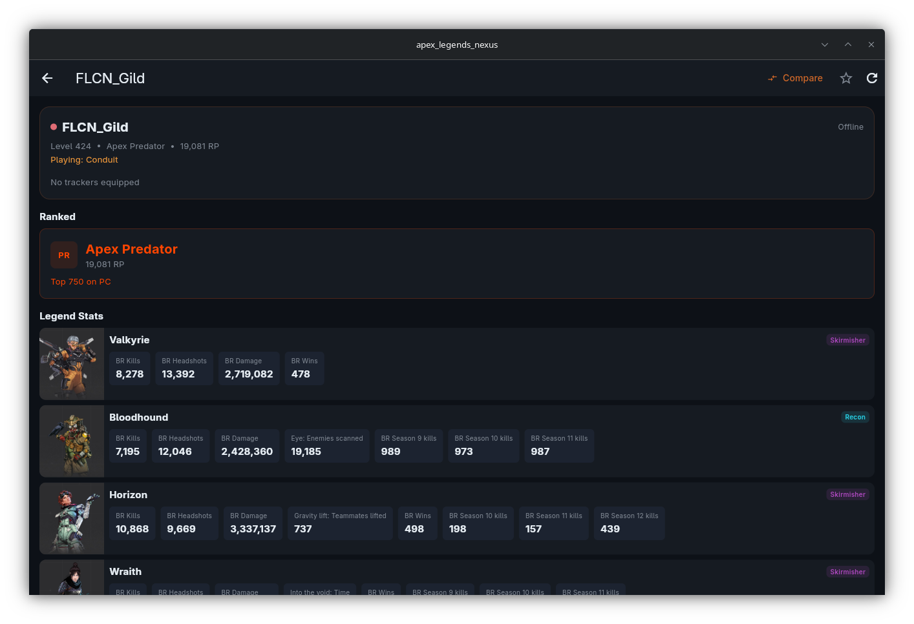
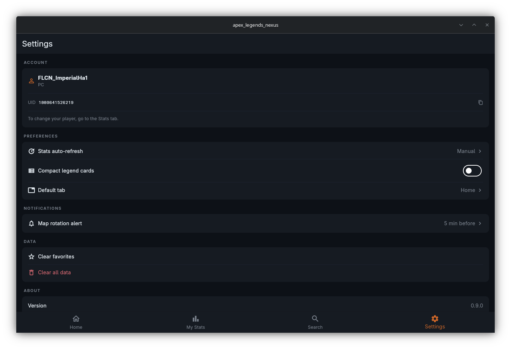

# Apex Legends Nexus

<p align="center">
  
</p>

<p align="center">
  <strong>Your offline-first Apex Legends companion.</strong><br/>
  Player stats · Map rotations · Server health · Push notifications
</p>

<p align="center">
  
  
  
  
  
  
  
</p>

---

## Overview

Apex Legends Nexus is an unofficial companion app for Apex Legends. No sign-in required — just link your in-game name and start tracking. All data is cached locally so the app keeps working when servers are slow.

- Look up any player's rank, legend stats, and RP history
- See which map is active right now and what's coming next
- Get notified before the map rotates so you're never mid-game when it swaps
- Check server latency per region before you queue
- Compare your stats head-to-head with any other player

> **Disclaimer:** Unofficial fan project. Not made by, affiliated with, or endorsed by Electronic Arts or Respawn Entertainment. Apex Legends is a trademark of Electronic Arts Inc.

---

## Screenshots

| Home | Stats | Search | Settings |
|------|-------|--------|----------|
|  |  |  |  |

---

## Features

### For Players

- **Player Stats** — Rank, RP, current legend, equipped trackers, and a rolling 24-hour RP delta badge. Supports search by name or numeric UID.
- **RP History Graph** — Visual chart of your rank progression over time, built from snapshots taken every 30 minutes.
- **Legend Stats** — Kill counts and tracker values per legend, merged across sessions and sorted by most-played.
- **Map Rotations** — Live countdown for Ranked, Pubs, and Mixtape. Shows current map, time remaining, and what loads next. Switches automatically when the rotation changes.
- **Predator Cutoff** — Current minimum RP to reach Apex Predator on PC, PlayStation, Xbox, and Switch.
- **Server Status** — Health of Origin Login, EA Accounts, Nova Fusion, and Apex Crossplay. Drill down to see per-region latency in milliseconds, color-coded green/orange/red.
- **Latest News** — In-game news feed from the official Apex feed.
- **Player Compare** — Side-by-side comparison of ranked stats or per-legend trackers with any searched player.
- **Favorites** — Star players to pin them to the search screen for one-tap access.

### Notifications

- Map rotation alerts: get notified 5, 10, or 15 minutes before the map changes.
- Choose which modes to track: Ranked, Pubs, Mixtape.
- Notifications fire even when the app is closed (via background fetch on iOS/Android).

### App

- **Offline-first** — All API responses are cached locally and shown with a staleness banner when the network is unavailable.
- **No account required** — Data is fetched using your public in-game name or UID.
- **Dark theme** — Designed for low-light gaming sessions.

---

## Installation

### Android

Download from Google Play (coming soon) or the latest or `.aab` from the [Releases](../../releases) page.

### iOS

Download from the App Store (coming soon).

### Windows

1. Download `apex-legends-nexus-installer.exe` from [Releases](../../releases)
2. Run the installer and follow the wizard
3. Launch from the Start Menu or Desktop shortcut

### Linux

1. Download `apex-legends-nexus-*.AppImage` from [Releases](../../releases)
2. Make executable and run:

   ```bash
   chmod +x apex-legends-nexus-*.AppImage
   ./apex-legends-nexus-*.AppImage
   ```

---

## Development

### Requirements

| Tool | Version |
|------|---------|
| Flutter SDK | 3.x (stable channel) |
| Dart SDK | bundled with Flutter |
| Android: Java | 17 |
| iOS/macOS: Xcode | 15+ |
| Windows: Visual Studio | 2022 (Desktop C++ workload) |
| Linux: GTK | `libgtk-3-dev` |

### Quick Start

```bash
# 1. Clone
git clone https://github.com/ajwadtahmid/ApexLegendsNexus.git
cd ApexLegendsNexus

# 2. Install dependencies
flutter pub get

# 3. Set up environment (see Configuration below)
cp .env.example .env
# edit .env with your values

# 4. Generate env code
dart run build_runner build --delete-conflicting-outputs

# 5. Run
flutter run
```

### Configuration

The app proxies all API calls through a private server — it never calls the Apex API directly. Credentials are stored in a `.env` file and compiled into the binary using [envied](https://pub.dev/packages/envied) (XOR-obfuscated at build time, not plain text in the binary).

```env
# .env
PROXY_URL=https://your-proxy-server.example.com
CLIENT_TOKEN=your-secret-token
```

After editing `.env`, regenerate:

```bash
dart run build_runner build --delete-conflicting-outputs
```

> `lib/env/env.g.dart` is generated and gitignored. The app will not compile without it.

### Project Structure

```
lib/
├── constants/         # Shared constants (API keys, pref keys, rank ladder)
├── env/               # Generated environment variables (gitignored)
├── models/            # Data models (PlayerStats, MapRotation, ServerStatus…)
├── providers/         # Riverpod providers and state notifiers
├── screens/           # One folder per tab (home, stats, search, settings)
├── services/          # API service, notification service, background service
├── utils/             # Formatters, cache, storage, theme helpers
└── widgets/           # Reusable UI components
```

### Architecture

```
UI (Screens/Widgets)
       │
       │ watches/reads
       ▼
  Riverpod Providers        ← state layer, caches AsyncValues
       │
       │ calls
       ▼
   ApiService (Dio)         ← single Dio instance, shared connection pool
       │
       │ HTTP
       ▼
   Proxy Server             ← never expose the real API key client-side
       │
       ▼
  Apex Legends Status API   ← apexlegendsstatus.com
```

**State management:** Riverpod 3 (`Notifier` / `AsyncNotifier` pattern). Providers are invalidated on pull-to-refresh and on a per-screen auto-refresh timer configurable in Settings.

**Caching:** `ApiCache` wraps `SharedPreferences` and stores each response alongside a timestamp. Stale entries (>24h) are ignored; fresh entries are returned immediately while a background refresh runs.

**Persistence:** Player snapshots and legend stats accumulate across sessions. A snapshot is written at most every 30 minutes (deduplicated by RP). `computeDelta()` in `storage.dart` computes the rolling 24-hour RP change.

**Notifications:** `flutter_local_notifications` schedules exact-time alerts. `background_fetch` reschedules them every 30 minutes so alerts stay accurate when the app is closed.

### Building for Release

```bash
# Android (App Bundle for Play Store)
flutter build appbundle --release

# Android (standalone APK)
flutter build apk --release --split-per-abi

# iOS
flutter build ios --release

# Windows
flutter build windows --release

# Linux (AppImage is packaged by CI)
flutter build linux --release
```

### CI / GitHub Actions

Pushing a tag matching `v*` triggers the release workflow, which:

1. Builds for Android (AAB + APK), Windows, and Linux in parallel
2. Packages the Linux build as an AppImage
3. Builds the Windows NSIS installer
4. Creates a GitHub Release and attaches all artifacts

---

## Data & Privacy

- **No login, no account.** All data is public (player stats are visible on apexlegendsstatus.com).
- **No analytics or tracking.** The app does not collect or send any user data.
- **Local-only storage.** Cached responses and snapshots are stored on-device only.
- **Credential safety.** The proxy token is XOR-obfuscated at compile time — it is not visible as a plain string in the distributed binary.

Data is sourced from [apexlegendsstatus.com](https://apexlegendsstatus.com) and [apexlegendsapi.com](https://apexlegendsapi.com).

---

## Contributing

Pull requests are welcome.

1. Fork the repo and create a branch: `git checkout -b feature/your-idea`
2. Make changes and run `flutter analyze` — zero issues required
3. Open a PR with a clear description of what changed and why

For larger changes, open an issue first to align on direction before writing code.

---

## License

[GNU General Public License v3.0](LICENSE)
